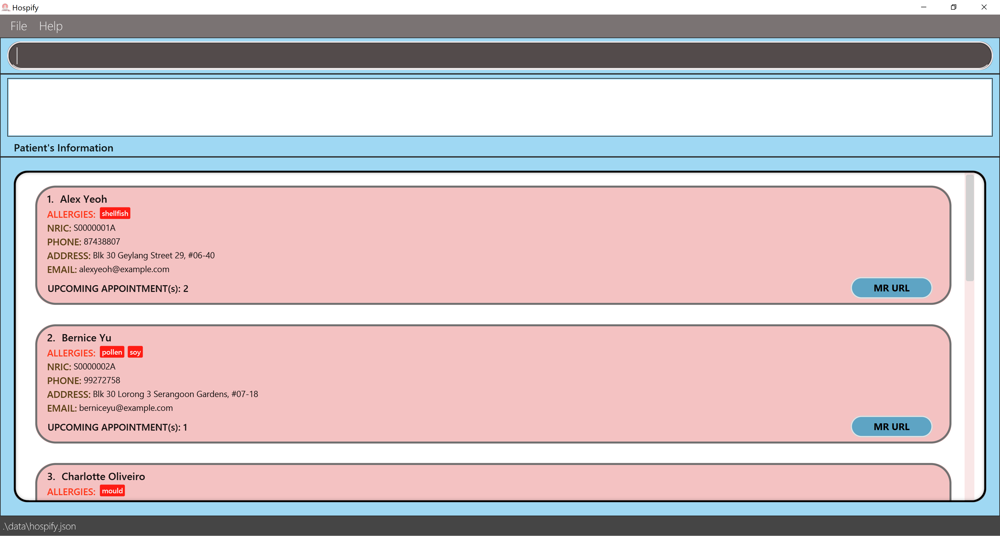
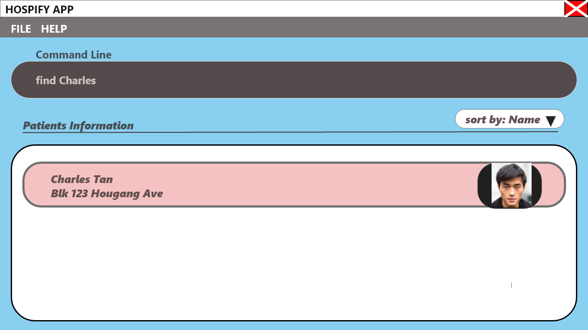
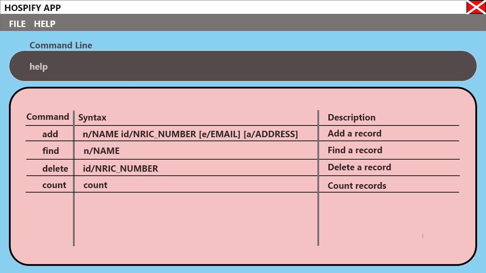
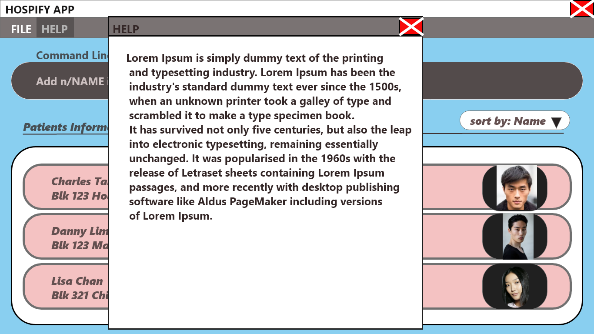

# Hospify e-Medical Records solution
  

**Hospify** is an application to help clinics digitalise their medical records.  
It is a brown-field project adapted from [`AddressBook 3`](https://se-education.org/addressbook-level3/).  

<u>**Motivation**</u>  
* **Problem Statement**  
Many small clinics still use hard copies to store patients' medical records. The database can get really large after many years. 
It is very expensive and time constraining to archive medical records and find medical records of patients when they revisit. There are also a lot of documents and folders which requires a lot of physical space to store.  
* **Solution**  
We will build an easily accessible and secure system that helps clinics to store the patients’ information and medical records. 
It will enable the admin staff to easily reach out to the patients and doctors and help them to contact each other.  

_Hospify is part of a team project under the CS2103 Software Engineering Module taken in the National University of Singapore._
## User stories  
<ol>
<li>As an admin staff who is a new user, I want to be able to see usage instructions so that I can refer to instructions when I forget how to use the app</li>
<li>As an admin staff, I can remind patients of their appointment in advance</li>
<li>As an admin staff, I can make new appointments for patients</li>
<li>As an admin staff, I can archive appointments and medical records of deceased patients or patients who have not visited the clinic for 5 years or more</li>
<li>As an admin staff, I can cancel appointment for patients</li>
<li>As an admin staff, I can access and retrieve medical records (like drug allergies) of patients when requested by doctors</li>
<li>As an admin staff, I can access and retrieve prescription list of patients when requested by the nurse</li>
<li>As an admin staff, I can access the hospitalized date of the patients</li>
<li>As an admin staff, I can access the discharged date of the patients</li>
<li>As an admin staff, I can access the location of the room of the patient if he/she is hospitalized</li>
<li>As an admin staff, I can edit and update the patients’ personal information</li>
<li>As an admin staff, I can edit and update the patients’ medical record after each appointment</li>
<li>As an admin staff, I can update patients’ payment progress</li>
<li>As an admin staff, I can store patient’s contact information and address</li>
<li>As an admin staff who is experienced in the app, I can create shortcuts to access the information I want</li>
<li>As an admin staff, I can find the patient on the app and create a new patient entry if he is not already in it.</li>
<li>As an admin staff, I can store NRIC of patients so that there is a unique way to identify patients and detect duplicates in the app</li>
<li>As a data entry clerk who is experienced in the app, I can use keywords to scan the documents so that I can verify if certain records have already been added</li>
<li>As an admin staff who is new to the app, I can verify the number of entries on the app so that I can make sure that all the hardcopy records are added</li>
<li>As an admin staff, I can sort the database according to the patients’ last visit.</li>
<li>As an admin staff, I can attach notes to high risk patients so that the clinic can check up on the patient in future.</li>
<li>As an admin staff, I can access all appointments for the day through a task bar so that I can send out reminders quickly</li>
<li>As an admin staff, I can tag dates on notes so that I can remind myself to call the patient on the tagged date</li>
<li>As an admin staff, I can access the tagged dates on my notes through a task bar so that I can check up on patients</li>
<li>As an admin staff, I can export all existing data in the app to a local drive so that it can serve as a backup if I want to reinstall/update the app.</li>
<li>As a data entry clerk who is relatively new to the app, I can load existing hardcopies of medical records and contact information of patients quickly onto the app</li>
</ol>

## Instructions to install
Download the `jar` file from the latest release and run on your local device. Please ensure that you have at least installed `Java JDK 11` on your local device.

## Guides / Notes  
[User Guide](docs/UserGuide.md)  
[About Us](docs/AboutUs.md)  
[Meeting notes](https://docs.google.com/document/d/14gDsicyg6XdIeHpiP8oH9UL7aLPPmoj9kUCA_w8ZNQU/edit?usp=sharing)
## Mock-ups (12 sept 2020)
**List** Command

**Find** command

**Help** command

##Credits
This project is based on the AddressBook-Level3 project created by the [SE-EDU initiative](https://se-education.org).
