* Table of Contents
{:toc}

--------------------------------------------------------------------------------------------------------------------

## **1. Introduction**

Hello, fellow developers!

Welcome to **Hospify**, a desktop application for a digital medical record management solution. In this developer guide, you will learn more about how this application is implemented and the design choices behind them.

**Hospify** is primarily adapted from the [AddressBook Level-3](https://github.com/nus-cs2103-AY2021S1/tp) program, which is subsequently modified to serve as a medical record storage solution targeted at administrative staff in clinics to reduce their dependency on printed medical records. The software provides basic functionalities required on a daily basis by clinic administrative staff, including adding, editing, finding, deleting and sorting medical records, as well as medical appointments of patients.

For easy navigation around this developer guide, hyperlinks to individual implementations have been provided at the top of the page. For ease of reading, we will be discussing the high-level implementation details first before zooming in to each design component and the implementation details.

--------------------------------------------------------------------------------------------------------------------

## **2. Setting up, getting started**

Please refer to the guide [_Setting up and getting started_](SettingUp.md) for more information about how to set up and configure the project in your computer.

You may also wish to refer to the source code [here](https://github.com/AY2021S1-CS2103T-W15-3/tp).

--------------------------------------------------------------------------------------------------------------------

## **3. Design**

In this section, we will be discussing the general design of the software. We will begin with its overall architecture to understand the high-level design of **Hospify**, followed by a closer look into each of the four major components, namely [`UI`](#ui-component), [`Logic`](#logic-component), [`Model`](#model-component) and [`Storage`](#storage-component).

### 3.1 Architecture

The ***Architecture Diagram*** given above explains the high-level design of the App. Given below is a quick overview of each component.

**`Main`** has two classes called [`Main`](https://github.com/AY2021S1-CS2103T-W15-3/tp/blob/master/src/main/java/seedu/address/Main.java) and [`MainApp`](https://github.com/AY2021S1-CS2103T-W15-3/tp/blob/master/src/main/java/seedu/address/MainApp.java). It is responsible for,
* At app launch: Initializes the components in the correct sequence, and connects them up with each other.
* At shut down: Shuts down the components and invokes cleanup methods where necessary.

[**`Commons`**](#common-classes) represents a collection of classes used by multiple other components.

The rest of the App consists of four components.

* [**`UI`**](#ui-component): The UI of the App.
* [**`Logic`**](#logic-component): The command executor.
* [**`Model`**](#model-component): Holds the data of the App in memory.
* [**`Storage`**](#storage-component): Reads data from, and writes data to, the hard disk.

Each of the four components,

* defines its *API* in an `interface` with the same name as the Component.
* exposes its functionality using a concrete `{Component Name}Manager` class (which implements the corresponding API `interface` mentioned in the previous point.

For example, the `Logic` component (see the class diagram given below) defines its API in the `Logic.java` interface and exposes its functionality using the `LogicManager.java` class which implements the `Logic` interface.

**How the architecture components interact with each other**

The *Sequence Diagram* below shows how the components interact with each other for the scenario where the user issues the command `delete 1`.

The sections below give more details of each component.

### 3.2 UI component

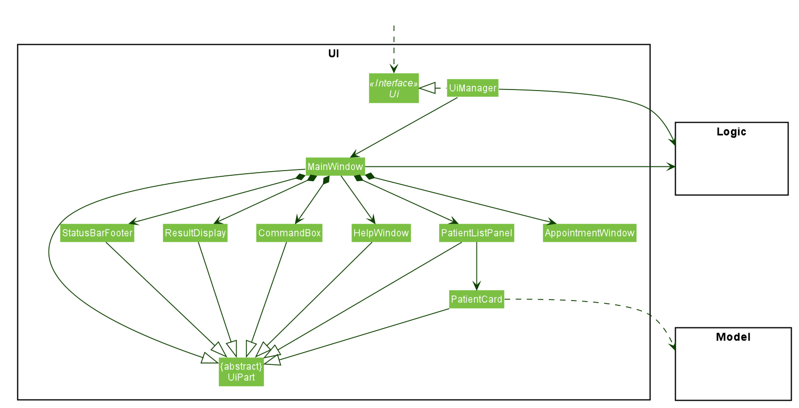

**API** :
[`Ui.java`](https://github.com/AY2021S1-CS2103T-W15-3/tp/blob/master/src/main/java/seedu/address/ui/Ui.java)

The UI consists of a `MainWindow` that is made up of parts e.g.`CommandBox`, `ResultDisplay`, `PatientListPanel`, `StatusBarFooter`, `AppointmentWindow` etc. All these, including the `MainWindow`, inherit from the abstract `UiPart` class.

The `UI` component uses JavaFx UI framework. The layout of these UI parts are defined in matching `.fxml` files that are in the `src/main/resources/view` folder. For example, the layout of the [`MainWindow`](https://github.com/AY2021S1-CS2103T-W15-3/tp/blob/master/src/main/java/seedu/address/ui/MainWindow.java) is specified in [`MainWindow.fxml`](https://github.com/AY2021S1-CS2103T-W15-3/tp/blob/master/src/main/resources/view/MainWindow.fxml)

The `UI` component,

* Executes user commands using the `Logic` component.
* Listens for changes to `Model` data so that the UI can be updated with the modified data.

### 3.3 Logic component

**API** :
[`Logic.java`](https://github.com/AY2021S1-CS2103T-W15-3/tp/blob/master/src/main/java/seedu/address/logic/Logic.java)

1. `Logic` uses the `HospifyParser` class to parse the user command.
1. This results in a `Command` object which is executed by the `LogicManager`.
1. The command execution can affect the `Model` (e.g. adding a patient).
1. The result of the command execution is encapsulated as a `CommandResult` object which is passed back to the `Ui`.
1. In addition, the `CommandResult` object can also instruct the `Ui` to perform certain actions, such as displaying help to the user.

Given below is the Sequence Diagram for interactions within the `Logic` component for the `execute("delete 1")` API call.

:information_source: **Note:** The lifeline for `DeleteCommandParser` should end at the destroy marker (X) but due to a limitation of PlantUML, the lifeline reaches the end of diagram.

### 3.4 Model component

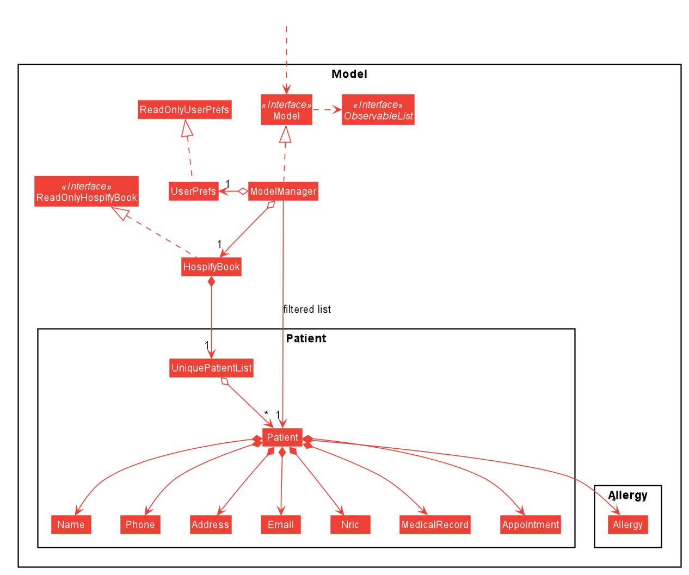

**API** : [`Model.java`](https://github.com/AY2021S1-CS2103T-W15-3/tp/blob/master/src/main/java/seedu/address/model/Model.java)

The `Model`,

* stores a `UserPref` object that represents the user’s preferences.
* stores the Hospify data.
* exposes an unmodifiable `ObservableList<Patient>` that can be 'observed' e.g. the UI can be bound to this list so that the UI automatically updates when the data in the list change.
* does not depend on any of the other three components.

:information_source: **Note:** An alternative (arguably, a more OOP) model is given below. It has a `Allergy` list in the `Hospify`, which `Patient` references. This allows `Hospify` to only require one `Allergy` object per unique `Allergy`, instead of each `Patient` needing their own `Allergy` object. 

### 3.5 Storage component

**API** : [`Storage.java`](https://github.com/AY2021S1-CS2103T-W15-3/tp/blob/master/src/main/java/seedu/address/storage/Storage.java)

The `Storage` component,
* can save `UserPref` objects in json format and read it back.
* can save the Hospify data in json format and read it back.

### 3.6 Common classes

Classes used by multiple components are in the `seedu.address.commons` package.

--------------------------------------------------------------------------------------------------------------------

## **4. Implementation**

In this section, we will be highlighting some key features and how they are being implemented. Example usage scenarios are provided to showcase how the features can be used. Lastly we will also be looking at other design choices and the rationale behind the current implementations.

### 4.1 Find by name or NRIC feature (by Cao Qin)

The find feature enables users to find patients by specifying their names (anyone from their first name, middle name or last name) or Nric numbers.

#### 4.1.1 Implementation

The following are the changes made to achieve this feature:

* A `KeywordPredicate` class is added under the `model/patient` package. 
* `FindCommand` class is modified to keep a KeywordPredicate object as a filed.
* `FindCommandParser` class is modified to parser both patients' name and nric number.

Given below is an example usage scenario of this feature using both name and Nric as inputs.

Step 1. The user executes `add n/Alex Yeoh ic/S0000001A p/87438807 e/alexyeoh@example.com a/Blk 30 Geylang Street 29, #06-40 mr/www.sample.com/01` to add a patient named Alex Yeho and with a Nric number “S0000001A”.

Step 2. The user executes `add n/Bernice Yu ic/S0000002A p/99272758 e/berniceyu@example.com a/Blk 30 Lorong 3 Serangoon Gardens, #07-18 mr/www.sample.com/02` to add a patient named Bernice Yu and with a Nric number “S0000002A”.

Step 3. The user executes `find Yeoh` command to find a patient with name "Yeoh".

Step 4. The user executes `find S0000001A` command to find a patient with Nric number "S0000001A".

Step 5. The user executes `find Alex S0000002A` command to find 2 patients: one with name “Alex” and one with Nric number “A0000002S”.

Step 6. The user executes `list` command to view the full list of patients.

The sequence diagram below illustrates Logic and Model Components when the user executes `find Alex S0000002A` command as in Step 5. 

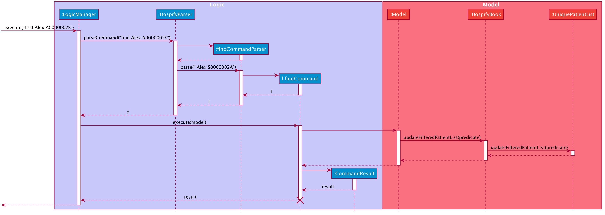

 
**:information_source: Note on sequence diagram:** 
 
* The lifeline for `findCommand` should end at the destroy marker (X) but due to a limitation of PlantUML, the lifeline reaches the end of diagram.

In the **Logic** Component, after user inputs `find Alex S0000002A`, these are the key methods:
* `LogicManager#execute("find Alex S0000002A")` : The `LogicManager` takes in the command text string ("find Alex S0000002").
* `HospifyParser#parseCommand("find")` : The `HospifyParser` parses the users' input and recognizes the command word, "find", and a `FindCommand` is created.
* `FindCommand#execute(model)` : The `FindCommand` uses the `updateFilteredPatientList` method of `Model` to update the displayed patients list and returns a `CommandResult` object which represents the result of a
command execution.

In the **Model** Component, the following key method is used:
* `Model#updateFilteredPatientLis(predicate)` : `Model` uses this method to update the displayed patients list.

The following activity diagram summarizes what happens when the user inputs a find command.

#### 4.1.2 Design Consideration

##### Aspect: What to use as reference to find the wanted patient?

* **Alternative 1 (current choice):** Requires users to enter names or Nric numbers or both of the patients wanted.
  * Pros: Easier for users to find the patients wanted if they know either the wanted patients' names or Nric numbers.
  * Cons: Harder to implement because the input may contain a mix of names and Nric numbers.

* **Alternative 2:** Users can only enter Nric numbers of the patients wanted. 
  * Pros: Easy to implement, and the finding results are accurate(the list will display the exact patients with the given Nric numbers). 
  * Cons: Inconvenient for users if they only know the patients' names.

### 4.2 Add Patient + Medical Record URL feature (by Cedric Lim Jun Wei)

#### 4.2.1 Implementation

The Medical Record URL (MR URL) feature enables users to add medical records of patients by specifying a URL containing his/her online medical record document. The following are the additions required for this feature:

* A `MedicalRecord` class is added under the `patient` package.
* A new prefix `mr/` is created to be used with the `add` and `edit` command to allow users to specify the url.
* A new `MR URL` button is added to individual patient's tab to allow users to copy the medical record url onto the system clipboard.

To understand how the Medical Record feature can be used, let us take a look at how the `add` command is implemented first.

1. After the input is entered by the user, the `LogicManager#execute(String commandText)` method calls the `HospifyParser#parseCommand(String userInput)` method for Hospify to parse and interpret the user input.

2. Based on `add` command word, an `AddCommandParser` object is created and the `AddCommandParser#parse(String args)` method is called for the `AddCommandParser` to parse and interpret the arguments in the user input.

3. Subsequently, an `AddCommand` object is created and returned as an output to the `LogicManager#execute(String commandText)` method.

4. The `LogicManager#execute(String commandText)` method then calls upon the `AddCommand#execute(Model model)` method, which in turn calls the `Model#addPatient(Patient patient)` method to add the new patient into Hospify.

5. Finally, a new `CommandResult` object is returned with a success message when the patient is added to Hospify.

The sequence diagram below illustrates how the operation of adding a patient works.

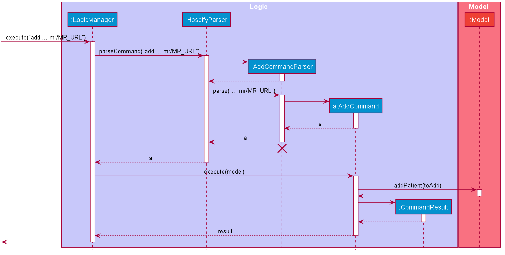 

**:information_source: Note on sequence diagram:** 

* The lifeline for `AddCommandParser` should end at the destroy marker (X) but due to a limitation of PlantUML, the lifeline reaches the end of diagram.

* For simplicity, the complete line of user input for the `add` command is omitted, showing only the `mr/www.medicalrecorddoc.com/patients1234567` portion, which is further simplified to `mr/MR_URL` in the sequence diagram.

* The `Patient` object created is shown as `toAdd` in the sequence diagram.

* The steps above illustrates a typical successful execution of the `add` command. In the activity diagram below, we will summarise all possible outcomes of executing this command.

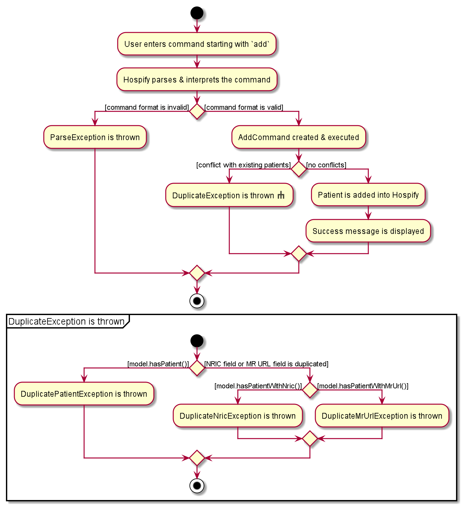

The `MR URL` is one the required fields that users must provide for the `add` command. Given below is an example usage scenario.

Step 1. The user executes `add n/John Doe …​ mr/www.medicalrecorddoc.com/patients1234567` command to add patient `John Doe` in Hospify.

Step 2. The user now decides to access the medical record of patient `John Doe` and can then do so by clicking on the `MR URL` button located at the bottom right corner of the patient's tab.

In doing so, the `PatientCard#copyUrl()` is called on the mouse click and the link to the medical record url is copied to the system clipboard.

Step 3. The user opens his/her preferred web browser and paste the url that was copied in step 2, and can then access the online medical record.

The following activity diagram summarizes what happens when a user adds a new patient:

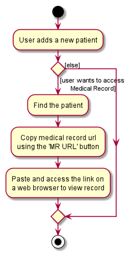

#### 4.2.2 Design consideration:

##### Aspect: How medical records are added and accessed

* **Alternative 1 (current choice):** Requires users to enter a unique url that links to the patient's online medical record each time a new patient is first added
  * Pros: Easy to implement and to edit medical records.
  * Cons: May be cumbersome for users to keep generating a new url for new patients.

* **Alternative 2:** Automatically generates an empty medical record when a new patient is added (which can be accessed/edited within Hospify).
  * Pros: Independent from external and online platforms (fully integrated within the application).
  * Cons: Harder to implement and less freedom to edit medical records.

### 4.3 Sort feature (by Chong Jia Le)

#### 4.3.1 Implementation

This feature enables the user to sort medical records of patients in ascending order based on : **name** or **NRIC**. The following are the additions required for this feature:

* A `SortBy` class, which is a custom comparator, is added under the `commands` package.
* A `SortCommand` class is added under the `commands` package.
* A `SortCommmandParser` class is added under the `parser` package to parse the sort command and recognize how patients are to be sorted.

Given below is an example usage scenario.

The sequence diagram below illustrates Logic and Model Components when the user executes `sort name` command to sort patients in Hospify alphabetically. 

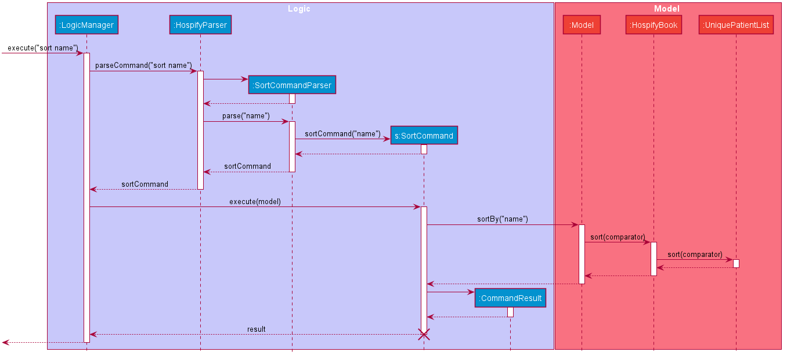

 
**:information_source: Note on sequence diagram:** 
 
* The lifeline for `SortCommand` should end at the destroy marker (X) but due to a limitation of PlantUML, the lifeline reaches the end of diagram.

In the **Logic** Component, after user inputs "sort name", these key methods:
* `LogicManager#execute("sort name")` : The `LogicManager` takes in a command text string ("sort name/nric").
* `HospifyParser#parseCommand("sort name")` : The `HospifyParser` parses the users input as a command word, "sort", and predicate,
"name". Using the command word, a `SortCommandParser` is created.
* `SortCommandParser#parse("name")` : The `SortCommandParser` takes in the predicate, "name", and parses it to create a `SortCommand`, with a specific predicate. A custom comparator, `SortBy`, is created
based on the predicate.
* `SortCommand#execute(model)` : The `SortCommand` uses the `SortBy` to sort the patients and returns a `CommandResult` object which represents the result of a
command execution.

In the **Model** Component, the following key methods are used:
* `Model#sort(sortBy)` : sorts the patients in `Hospify` using the given `sortBy` comparator.
* `HospifyBook#sort(sortBy)` : sorts patients stored in a `UniquePatientList` using the given `sortBy` comparator.
* `UniquePatientList#sort(sortBy)` : sorts the patients stores in a stream using sort function.

After the command is executed, a success message is displayed and the sorted list is shown in the application.

The following activity diagram summarizes what happens when the user inputs a sort command.

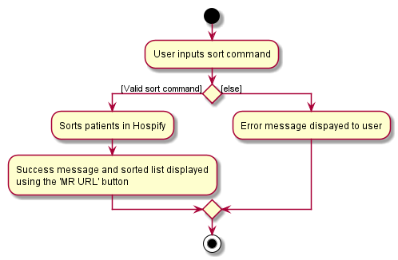

#### 4.3.2 Design consideration:

##### Aspect: How sort is implemented

* **Alternative 1 (current choice):** The list is only sorted at the moment when user inputs sort command
  * Pros : Easy to implement and quick to add new patients.
  * Cons : Cumbersome for users to repeatedly input sort command after each addition of new patients.
* **Alternative 2:** The list remains sorted once user inputs sort command
  * Pros : More convenient for user as list will sort itself after every addition of patient.
  * Cons : Harder to implement and might make the app slower.
  
  
### 4.4 Count feature (by Chong Jia Le)

#### 4.4.1 Implementation

This feature enables the user to count the number of patients in Hospify. The following are the additions required for this feature:

* A `CountCommand` class is added under the `commands` package.

Given below is an example usage scenario.

The sequence diagram below illustrates Logic and Model Components when the user executes `count` command to sort patients in Hospify alphabetically. 

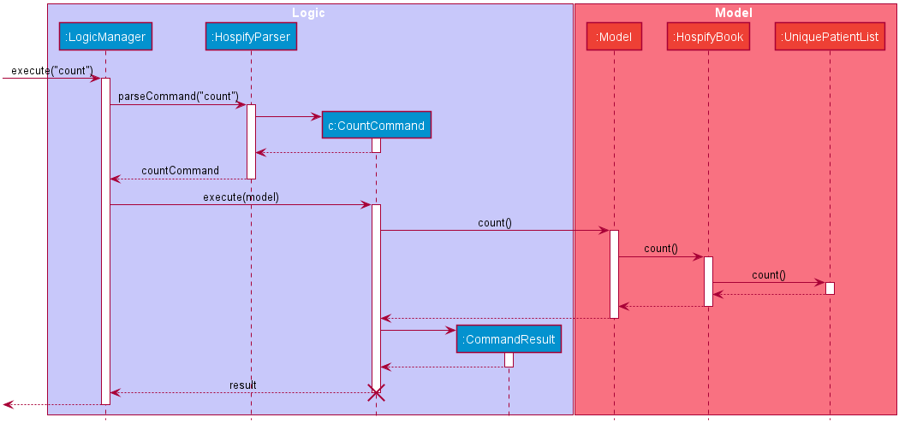

 
**:information_source: Note on sequence diagram:** 
 
* The lifeline for `SortCommand` should end at the destroy marker (X) but due to a limitation of PlantUML, the lifeline reaches the end of diagram.

In the **Logic** Component, after user inputs "count", these key methods:
* `LogicManager#execute("count")` : The `LogicManager` takes in the command text string ("count").
* `HospifyParser#parseCommand("count")` : The `HospifyParser` parses the users input and recognizes the command word, "count", and a `CountCommand` is created.
* `CountCommand#execute(model)` : The `CountCommand` uses the count method of `Model` to count the number of patients and returns a `CommandResult` object which represents the result of a
command execution.

In the **Model** Component, the following key methods are used:
* `Model#count()` : counts the patients in `Hospify` using the count method in `HospifyBook`.
* `HospifyBook#scount()` : counts patients using the count method in `UniquePatientList`.
* `UniquePatientList#count()` : counts the patients using the count function of Streams.

After the command is executed, a success message is displayed in the application. (i.e. There are 10 patients.)

The following activity diagram summarizes what happens when the user inputs a count command.

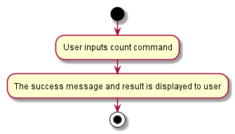

#### 4.4.2 Design consideration:

##### Aspect: How count is implemented

* **Alternative 1 (current choice):** Count command only counts the total patients in record
  * Pros : Easy to implement and quick to count.
  * Cons : User is unable to count number of search results.
* **Alternative 2:** Count command can count number of results after find is executed.
  * Pros : User is able to count number of search results.
  * Cons : Harder to implement.

### 4.5 Appointment feature (by Gabriel Teo Yu Xiang)

The appointment feature will enable clinics to manage patient's appointments within Hospify, thus avoiding the need for spreadsheets.
Users have the ability to show, add, delete, edit appointments within the app. 

#### 4.5.1 Implementation
##### Overview:

* An `Appointment` class is created in the `patient` package.
* A new prefix `appt/` to be used with the new `Appointment` field.
* 4 new commands specifically for managing patients' appointments, `showAppt`, `addAppt`, `editAppt` and `deleteAppt`.

Given below is an example usage scenario using a Patient with `NRIC` **S1234567A**.

Step 1. The user executes `addAppt S1234567A /appt 28/09/2020 20:00` command to add an appointment with the
 specified time to the patient with `NRIC`of S1234567A.

Step 2. The user shows the appointment of the patient by **clicking** on the patient using the `GUI` or 
using the command `showAppt S1234567A`.

Step 3. The user now decides to edit the appointment of patient of `NRIC` S1234567A and executes `editAppt S1234567A /appt 05/10/2020 20:00` to change the appointment timing accordingly.

Step 4. The user then decides to delete the appointment of patient of `NRIC` S1234567A and executes `deleteAppt S1234567A /appt 05/10/2020 20:00` to delete the specified appointment.

The following activity diagram summarizes what happens when a user adds a new appointment:

#### 4.5.2 Design consideration:

##### Aspect: How appointments are added and managed

* **Alternative 1 (current choice):** Appointments are stored as a `HashSet` attribute within each patient.
  * Pros: Easy to implement and each patient can have multiple appointments.
  * Cons: May be messy as the number of appointments can get very large depending on the patient, making it difficult to keep track.

* **Alternative 2:** An Appointment also keeps track of additional details. (appointment history, time started, time ended)
  * Pros: Able to store more detailed information about a patient's appointments.
  * Cons: Harder to implement and more details for the user to manage and keep track of.

* **Alternative 3:** Each patient only stores one Appointment.
  * Pros: Easy to implement and manage.
  * Cons: Very limited functionality as each patient can only have one appointment booked at a time.

_{more aspects and alternatives to be added}_

### 4.6 Show Appointment feature (by Peh Jun Siang)

Shows the medical records of a patient either through the `CLI` or the `GUI` in a Tableview.

#### 4.6.1 Implementation
###### Overview:

The **Activity Diagram** below shows an overview for users to show the Patient's appointments through 
the `GUI` or `CLI`.

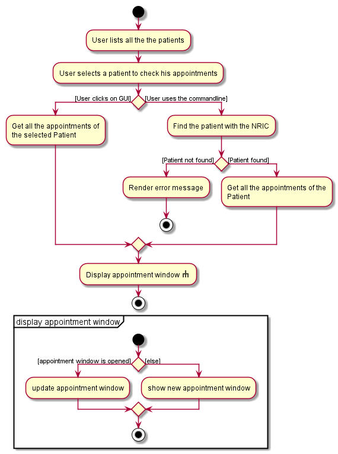

###### Detailed Implementation:

* Using the `GUI`
    * **Sequence Diagram** for `GUI`\
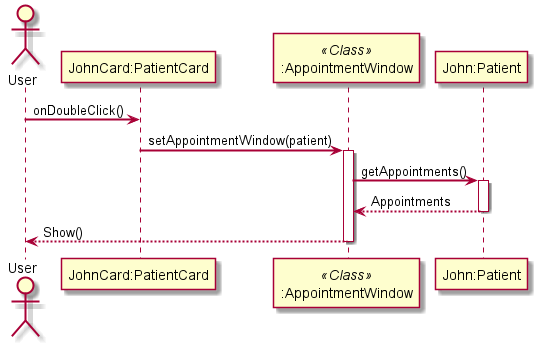
        * Clicking on the Patient Card triggers the `PatientCard#onDoubleClick` controller which updates the 
        static `AppointmentWindow` **housed in MainWindow**.
        * The controller calls `MainWindow#setAppointmentWindow(patient)` to update the information of the 
        patient in `AppointmentWindow`. 
        * `AppointmentWindow` retrieves all the appointments of the patient and map the
        appointments into `AppointmentDescription`(s). The purpose of `AppointmentDescription` is
         to format long strings, and make sure it looks good in the column of the tableView before calling 
         `AppointmentWindow#show()` to show the window. 
* Using the `CLI`\
`ShowAppt` on the `CLI` is more complicated than using the `GUI` because we have to find the 
patient and check if the NRIC entered is valid. On the `GUI`, we only have to use a controller 
to check if the patient is clicked and show the `AppointmentWindow` on the click event.
    * **Sequence Diagram** for `CLI`\
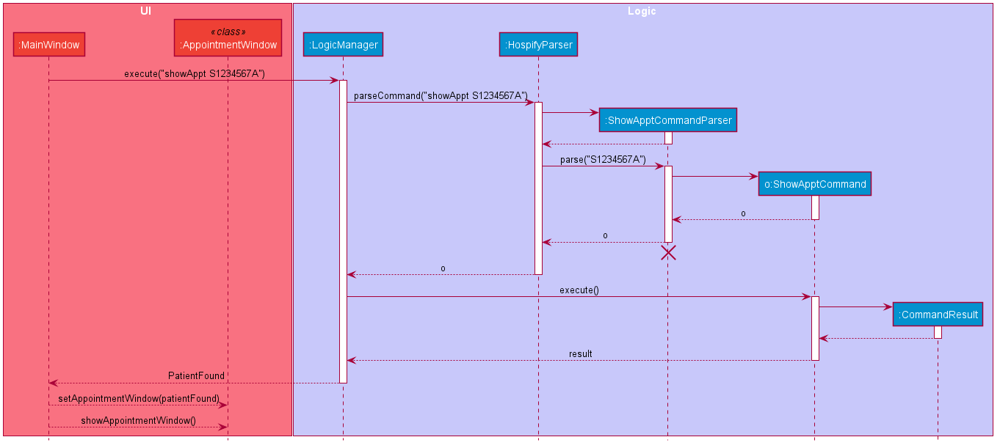
**Description**
        1. The `MainWindow` takes in the String command from the user in the **UI**.
        1. `MainWindow` passes the String command to `LogicManager#execute()` under **Logic** showed in the Sequence Diagram above.
        1. `ShowCommandparser#parse()` verifies the command is in the stipulated format.
        1. `LogicManager#execute()` executes the showAppt command.
        1. `ShowApptCommand#execute()` then verifies if only **ONE** patient with the **NRIC** is found.
         Otherwise, it throws a commandException which notifies the user about the exact error.
        1. If the patient is found successfully, `ShowApptCommand#execute()` updates the patient found
         to the `AppointmentWindow` housed in MainWindow by calling the **static** method 
         `MainWindow#setAppointmentWindow(patient)`.
        1. The `MainWindow` receives the command result from `LogicManager#execute()` and checks if the command is
        requires `AppointmentWindow` to be shown by calling the `CommandResult#isShowAppointment()`.
        1. The process in which the appointments are retrieved and rendered are similar to the `GUI` described above.
        1. Finally, `MainWindow` shows the calls the `AppointmentWindow#show()`.
        

**:warning: Important:** AppointmentWindow is **STATIC** (i.e. only **ONE** instance of AppointmentWindow is allowed).
This design is to prevent Users from opening multiple windows of the same patient and freezing the App.

### 4.7 Help feature (by Peh Jun Siang)
###### Overview:

The Help window shows all the commands that are available to **Hospify**.

###### Implementation:
The process in which the `HelpWindow` is shown is similar to the [showApptCommand](#46-show-appointment-feature-by-peh-jun-siang)
 using the **CLI**.

The only **main differences** are,
* The `HelpWindow` does not have a parser.
* Instead of retrieving appointments, it retrieves the `COMMAND_USAGE` from each of the commands and render them
into a `CommandDescription` similar to `AppointmentDescription` which is responsible from making the Strings look good
in the `HelpWindow`.
* `MainWindow#execute()` checks for `isHelpWindow()` and calls `HelpWindow#show()` instead of `AppointmentWindow#show()`.

The process in which the `CommandDescription` are rendered into a tableView is identical 
to [showApptCommand](#46-show-appointment-feature-by-peh-jun-siang).

--------------------------------------------------------------------------------------------------------------------

## **5. Documentation, logging, testing, configuration, dev-ops**

* [Documentation guide](Documentation.md)
* [Testing guide](Testing.md)
* [Logging guide](Logging.md)
* [Configuration guide](Configuration.md)
* [DevOps guide](DevOps.md)

--------------------------------------------------------------------------------------------------------------------

## **6. Appendix: Requirements** (by Gabriel Teo Yu Xiang)

### 6.1 Product scope

**Target user profile**:

* Administrative staff in clinics
* has a need to manage a significant number of patients and their respective medical records
* prefers desktop apps over other types
* can type fast
* prefers typing to mouse interactions
* is reasonably comfortable using CLI apps

**Value proposition**:

- What problem does it solve?
    * Many small clinics still use hard copies to store patients' medical records. The database can get really large after many years. It is very expensive and time constraining to archive medical records and find medical records of patients when they revisit. There are also a lot of documents and folders which require a lot of physical space to store.
- How does it make their lives easier?
    * We will build an easily accessible and secure system that helps clinics to store the patients’ information and medical records. It will enable the admin staff to easily reach out to the patients and doctors and help them to contact each other.

### 6.2 User stories

Priorities: High (must have) - `* * *`, Medium (nice to have) - `* *`, Low (unlikely to have) - `*`

| Priority | As an …​                                | I want to …​                | So that I can…​                                                      |
| -------- | ------------------------------------------ | ------------------------------ | ----------------------------------------------------------------------- |
| `* * *`  | admin staff who is a new user              | see usage instructions         | refer to instructions when I forget how to use the App                  |
| `* * *`  | admin staff                                | add a new patient              | store a new patient's medical records                                   |
| `* * *`  | admin staff                                | delete a patient               | remove entries that I no longer need                                    |
| `* * *`  | admin staff                                | find a patient by name         | locate details of patients without having to go through the entire list |
| `* *`    | admin staff with many patients in the App  | view the number of patients    | have an overview of the size of the database                            |
| `* *`    | admin staff                                | make new appointments for patients | arrange an appointment timing easily |
| `* *`    | admin staff                                | cancel appointments for patients | cancel an appointment timing easily |
| `* * *`  | admin staff                                | access and retrieve medical records (like drug allergies) of patients | obtain them when requested by doctors |
| `* * *`  | admin staff                                | access and retrieve prescription list of patients | obtain them when requested by nurses |
| `* * *`  | admin staff                                | store NRIC of patients | uniquely identify patients and detect duplicates in the App |
| `* * *`  | admin staff                                | use keywords to scan documents | verify if certain records have already been added |
| `* *`    | admin staff who is a new user              | verify the number of entries on the App | make sure that all the hardcopy records are added |
| `* * *`  | admin staff                                | edit and update the patients’ personal information | make any changes when necessary |
| `* *`    | admin staff with many patients in the App  | sort the database according to the patients’ last visit | locate a patient easily |
| `*`      | admin staff                                | archive appointments and medical records | store away less relevant information about deceased patients or patients who have not visited the clinic for 5 years or more |

### 6.3 Use cases

(For all use cases below, the **System** is `Hospify` and the **Actor** is the `admin`, unless specified otherwise)

**Use case: UC1 - Add patient information**

**MSS**

1.  Admin types `add` followed by patient details.
2.  Hospify notifies that patient information is added.

    Use case ends.

**Extensions**

* 1a. Hospify detects that the input is in the wrong format.

    * 1a1. Hospify requests for the correct data.
    * 1a2. Admin enters new data.

      Steps 1a1-1a2 are repeated until the data entered are correct.

      Use case resumes at step 2.
      
* 1b. Hospify detects that certain input that should not be duplicated is entered.

    * 1b1. Hospify notifies user that the specific input already belong to an existing patient in Hospify.
    * 1b2. Hospify requests for valid data.
    * 1b3. Admin enters valid data.

      Steps 1b1-1b3 are repeated until the data entered are valid and not duplicated.

      Use case resumes at step 2.

**Use case: UC2 - Delete patient information**

**MSS**

1.  Admin types `delete` followed by patient NRIC.
2.  Hospify removes specified patient from the list.
3.  Hospify notifies that patient information is deleted.

    Use case ends.

**Extensions**

* 1a. Hospify detects that the input is in the wrong format.

    * 1a1. Hospify requests for the correct data.
    * 1a2. Admin enters new data.

      Steps 1a1-1a2 are repeated until the data entered are correct.

      Use case resumes at step 2.

**Use case: UC3 - Find patient information**

**MSS**

1.  Admin wants to find a patient using their name.
2.  Admin types `find` followed by keyword (name).
3.  Hospify returns all matches (if any) to the staff.
4.  Admin selects the patient of interest.

    Use case ends.

**Extensions**

* 2a. Hospify detects invalid characters (e.g. numbers and symbols).

    * 2a1. Hospify requests for the correct data.
    * 2a2. Admin enters new data.

      Steps 2a1-2a2 are repeated until the data entered are correct.

      Use case resumes at step 3.

**Use case: UC4 - Compute number of entries**

**MSS**

1.  Admin types `count`.
2.  Hospify displays the number of patients that are currently not archived.

    Use case ends.

**Use case: UC5 - Display usage instructions**

**MSS**

1.  Admin types `help`.
2.  Hospify displays help interface.

    Use case ends.
    
**Use case: UC6 - Display patient's appointment**

**MSS**

1.  Admin types `ShowAppt` followed by patient NRIC.
2.  Hospify shows a window which shows all of the patient's appointments.
3.  Admin sorts the appointments by earliest to latest or latest to earliest.

    Use case ends.
    
**Extensions**
* 1a. User with NRIC not found.
    * 1a1. Hospify notifies the User that the User is not found.
    * 1a2. User enters another NRIC.

* 1b. User enters an invalid NRIC.
    * 1b1. Hospify prompts User to enter in the stipulated format.
    
    Steps 1b1 repeats until user enters a valid NRIC.

**Use case: UC7 - Display full list of patients**

**MSS** 

1.  Admin types `list`.
2.  Hospify displays a complete list of patients stored in the application.

    Use case ends.
    
**Use case: UC8 - Edit patient information**

This use case is similar to UC1, except that the admin can choose to edit any field and any number of them.

**Use case: UC9 - Sort list of patients by name**

**MSS** 

1.  Admin types `sort name`.
2.  Hospify displays the list of patients sorted by their name in ascending order.

    Use case ends.
    
**Use case: UC10 - Sort list of patients by NRIC**

This use case is similar to UC9, except that the command `sort NRIC` is used and the patients are sorted by their NRIC in ascending order.

**Use case: UC11 - Add patient appointment**

**MSS** 

1.  Admin types `addAppt`, followed by patient NRIC, appointment date and time, and description of appointment.
2.  Hospify notifies that patient appointment is added.

    Use case ends.

**Extensions**

* 1a. Hospify detects that the input is in the wrong order, the NRIC is invalid, or the appointment date and time format is incorrect.

    * 1a1. Hospify requests for the correct data.
    * 1a2. Admin enters new data.

      Steps 1a1-1a2 are repeated until the data entered are correct.

      Use case resumes at step 2.
      
**Use case: UC12 - Edit patient appointment**

This use case is similar to UC11, except that the fields required are the patient NRIC, old appointment date and time, and new appointment date and time.

**Use case: UC13 - Delete patient appointment**

This use case is similar to UC11, except that the fields required are the patient NRIC and the date and time of the appointment to be deleted.

**Use case: UC14 - Access patient medical record**

**MSS** 

1.  Admin wants to access the medical record of a patient.
2.  Admin finds the patient (UC3).
3.  Admin clicks on the `MR URL` button.
4.  Hospify copies the medical record url to the system clipboard.
5.  Admin opens the web browser and pastes the url onto the search bar.
6.  Web browser displays the medical record of the patient.

    Use case ends.
    
**Extensions**

* 1a. Admin types `showMr`, followed by patient NRIC.

    * 1a1. Hospify redirects admin by opening the default web browser.

      Use case resumes at step 6.
      
**Use case: UC15 - Clear list of patients**

**MSS** 

1.  Admin types `clear`.
2.  Hospify deletes all patient entries stored in the application.

    Use case ends.
      

### 6.4 Non-Functional Requirements

1.  Should work on any _mainstream OS_ as long as it has Java `11` or above installed.
2.  Should be able to hold up to 1000 patients without a noticeable sluggishness in performance for typical usage.
3.  A user with above average typing speed for regular English text (i.e. not code, not system admin commands) should be able to accomplish most of the tasks faster using commands than using the mouse.
4.  The system should work on both 32-bit and 64-bit environments.
5.  The system should respond within two seconds to user inputs.
6.  The system should be user-friendly to new users and easy to learn.
7.  The system should be backward compatible with older versions of the product.
8.  The system is expected to be able to save and load user input data from the hard drive.
9.  The system is expected to be able to `sort` patients according to their `name`, `NRIC` or `appointment`.
10.  The system does not support printing of reports (patient details).
11.  The system does not support syncing data with other clinics’ patients’ details.

### 6.5 Glossary

* **Mainstream OS**: Windows, Linux, Unix, OS-X
* **NRIC**: National Registration Identity Card - A unique identification system with 1 alphabet followed by 7 digits, and another alphabet. E.g  X1234567X, where X is an arbitrary Alphabet
* **MR URL**: Medical Record URL - A unique web address link to a specific patient's online medical record

--------------------------------------------------------------------------------------------------------------------

## **7. Appendix: Instructions for manual testing**

Given below are instructions to test the app manually.

:information_source: **Note:** These instructions only provide a starting point for testers to work on;
testers are expected to do more *exploratory* testing.

### 7.1 Launch and shutdown

1. Initial launch

   1. Download the jar file and copy into an empty folder

   1. Double-click the jar file. 
      Expected: Shows the GUI with a set of sample patients. The window size may not be optimum.

1. Saving window preferences

   1. Resize the window to an optimum size. Move the window to a different location. Close the window.

   1. Re-launch the app by double-clicking the jar file. 
      Expected: The most recent window size and location is retained.

### 7.2 Deleting a patient

1. Deleting a patient while all patients are being shown

   1. Prerequisites: List all patients using the `list` command. Multiple patients in the list.

   1. Test case: `delete 1` 
      Expected: The first patient (index 1) on the list is deleted. Details of the deleted patient shown in the status message. Timestamp in the status bar is updated.
      
   1. Test case: `delete S0000001A` 
      Expected: The patient with NRIC S0000001A is deleted. Details of the deleted patient shown in the status message. Timestamp in the status bar is updated.

   1. Test case: `delete 0` 
      Expected: No patient is deleted. Error details shown in the status message. Status bar remains the same.

   1. Other incorrect delete commands to try: `delete`, `delete x`, `...` (where x is larger than the list size) 
      Expected: Similar to previous.

### 7.3 Saving data

1. Dealing with missing/corrupted data files

   1. Delete the file `data/hospify.json` (this is to simulate a missing/corrupted data file).
   
   1. Re-launch the app by double-clicking the jar file. 
      Expected: A new `data/hospify.json` file containing a set of sample patients is created.

1. Auto-saving

   1. Launch Hospify and delete the first patient on the list using `delete 1`. Exit the app.
   
   1. Re-launch the app by double-clicking the jar file. 
      Expected: The change that you have made is retained (i.e. the first patient is no longer in the list).
